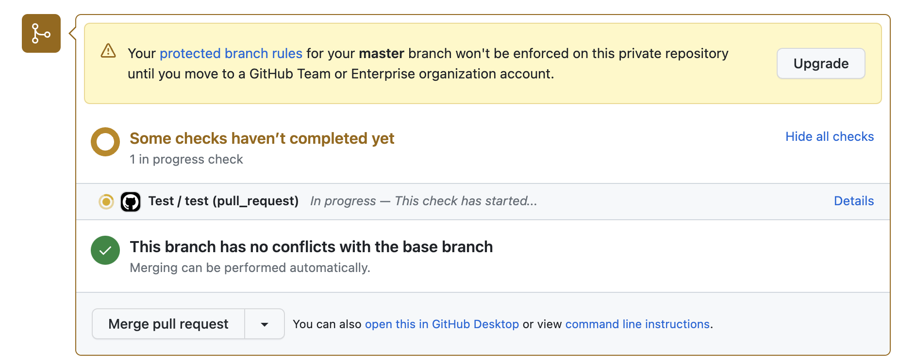

# Álvaro's DevOps Assessment Homework
This home assignment consists in three mayor blocks
1. Dockerize the application
2. Terraforming the infrastructure needed to run the application
3. CI/CD workflow

## Preparation
I created a virtualenv and run:
`python setup.py install && FLASK_APP=hello flask run`
Then I checked that the tests where passing:
```
================ test session starts ==============
platform darwin -- Python 3.11.3, pytest-7.3.1, pluggy-1.0.0
rootdir: /Users/alvaro.salva/Personal/devops-assesment
collected 1 item                                                                                                                                                                                          

tests/test_hello.py .                        [100%]

================= 1 passed in 0.01s ===============
```

## Dockerize the service
First, I did the Dockerfile to build an image needed to run the container in Fargate. I started by a very simple one and then I refactored it to get an smaller image size.

```
FROM --platform=linux/amd64 python:3.11.3-slim

WORKDIR /app
COPY . .
RUN pip install --no-cache-dir .

# Create a non-root user to run the app
RUN useradd -m flaskuser 
RUN chown -R flaskuser:flaskuser /app
USER flaskuser

ENV FLASK_APP=hello

EXPOSE 5000

CMD ["flask", "run", "--host=0.0.0.0"]
```

## Terraform infrastructure
Using the default VPC and subnets, I created a ECS cluster and an ALB. I did not create an ECR repository as I used dockerhub for docker registry.

I created the task definition to make sure it works, although the CI/CD worflow should be used from now on.

I created the docker image using and ARM-based computer, therefore it did not work at the first attempt. I splicitly used amd64 in the Dockerfile to avoid this issues. Other option would be to specify the ARM architecture in the task definition.

## CI/CD Workflow
The CI/CD process is done using Github actions. You can find the definitions at `.github/actions` folder.


### Test when PR opened
When a master's Pull Request is opened, the unit tests are run. If they fail, the branch protection rule would not allow to merge.

### Build & deploy when PR merged
When a PR is merged, two jobs are run one after the other. The docker image is created and published in the first job. If succeded, it gets deployed in the ECS cluster. 

## Troubles I faced

1 - The branch protection rules are not enforced if not upgraded to a higher plan


2 - I could use a TAG to deploy to ECS when pushing to a branch, but not when merging a PR. Using the commit SHA instead (I try to avoid using "latest" as much as I can)

3 - I could not read or create log groups due to lack of permissions. Not blocking.